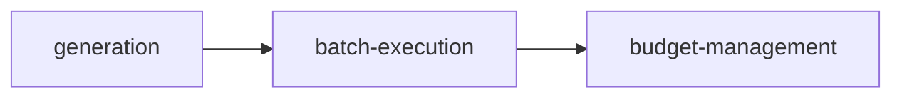

<div align="center">


### Centralized NanoBanana image generation service using WisGate (JuheAPI) with rate limiting, token-based cost tracking, budget guards, retry/backoff, batch parallel execution, and generation gallery


[](https://www.typescriptlang.org/)

[](https://bun.sh/)

</div>

---

## 📑 Table of Contents

- [✨ Features](#features)
- [🏗 Architecture](#architecture)
- [🛠 Tech Stack](#tech-stack)
- [🚀 Getting Started](#getting-started)
- [💻 Development](#development)
- [📡 API Reference](#api-reference)
- [📂 Project Structure](#project-structure)
- [🤝 Contributing](#contributing)
- [📄 License](#license)

---

## ✨ Features

| Feature | Description |
|---------|-------------|
| **image-generation** | Core task type |
| **batch-image-generation** | Core task type |
| **cost-tracking** | Core task type |
| **text-prompt Input** | Supported input type |
| **reference-images Input** | Supported input type |
| **generation-config Input** | Supported input type |
| **generated-image Output** | Supported output type |
| **token-usage Output** | Supported output type |
| **budget-status Output** | Supported output type |

---

## 🏗 Architecture


ImageEngine processes data through a multi-stage pipeline:



---

## 🛠 Tech Stack

### Backend

| Technology | Purpose |
|------------|---------|
| **TypeScript 5.7** | Type safety |
| **Bun** | JavaScript runtime & package manager |
| **Hono 4** | Lightweight web framework |

---

## 🚀 Getting Started

### Prerequisites

- [**Bun**](https://bun.sh/) v1.0+ — `curl -fsSL https://bun.sh/install | bash`

### Install

```bash
cd systems/image-engine
bun install
```

### Run

```bash
bun run systems/image-engine/src/index.ts
```

---

## 💻 Development

| Command | Description |
|---------|-------------|
| `bun run dev` | Start development mode |
| `bun run build` | Build for production |
| `bun test` | Run tests |
| `bun run lint` | Check code quality |

---

## 📡 API Reference

| Method | Endpoint | Description |
|--------|----------|-------------|
| `GET` | `/` | GET /api/gallery — paginated list of generations |
| `GET` | `/:id` | GET /api/gallery/:id — single generation details |
| `GET` | `/:id/image` | GET /api/gallery/:id/image — serve binary image |
| `POST` | `/:id/use-as-reference` | POST /api/gallery/:id/use-as-reference — return base64 for use as reference |
| `GET` | `/` | GET /api/budget — current budget status |
| `PUT` | `/ceiling` | PUT /api/budget/ceiling — update token ceiling |
| `GET` | `/history` | GET /api/budget/history — token usage history with optional date range |
| `GET` | `/wisgate-balance` | GET /api/budget/wisgate-balance — live WisGate balance |
| `POST` | `/` | POST /api/generate — single image generation |
| `POST` | `/batch` | POST /api/generate/batch — batch image generation |

---

## 📂 Project Structure

```
image-engine/
├── README.md
├── imageengine.db
├── imageengine.db-shm
├── imageengine.db-wal
├── images
│   ├── hero.svg
│   └── pipeline.svg
├── justfile
├── knowledge
│   ├── acceptance-criteria.md
│   ├── dependencies.md
│   ├── domain.md
│   └── scope.md
├── logs
│   ├── 6471471b-6899-48cc-af0c-7bb462afb381
│   │   ├── chat.json
│   │   ├── notification.json
│   │   ├── permission_request.json
│   │   ├── post_tool_use.json
│   │   ├── post_tool_use_failure.json
│   │   ├── pre_tool_use.json
│   │   └── stop.json
│   ├── session_end.json
│   └── user_prompt_submit.json
├── package.json
├── scripts
│   └── generate-storyboard-scenes.ts
├── src
│   ├── db.ts
│   ├── index.ts
│   ├── lib
│   │   └── batch-executor.ts
│   ├── middleware
│   │   ├── budget-guard.ts
│   │   └── rate-limiter.ts
│   ├── routes
│   │   ├── budget.ts
│   │   ├── gallery.ts
│   │   └── generate.ts
│   ├── types.ts
│   └── wisgate.ts
├── tsconfig.json
└── uploads
    ├── 44d21698-7b1a-426f-b71b-7821e4e01e04.png
    ├── 487862ca-77f9-45b4-b8b5-8d42ba5a8374.png
    ├── 6cdd5970-7dad-4fc0-a810-aae71b0e7702.png
    ├── ca288f08-abf7-4eab-9717-270e930fd24c.png
    └── da60854a-41f6-4350-8b99-45d0fbe07f8a.png
```

---

## 🤝 Contributing

Contributions are welcome! Here's how to get started:

1. Fork the repository
2. Create a feature branch: `git checkout -b feat/my-feature`
3. Make your changes and ensure tests pass
4. Commit your changes and open a pull request

---

## 📄 License

This project is licensed under the [MIT License](LICENSE).

---

<div align="center">

**Built with** 🧡 **using Bun, Hono, TypeScript**

</div>
